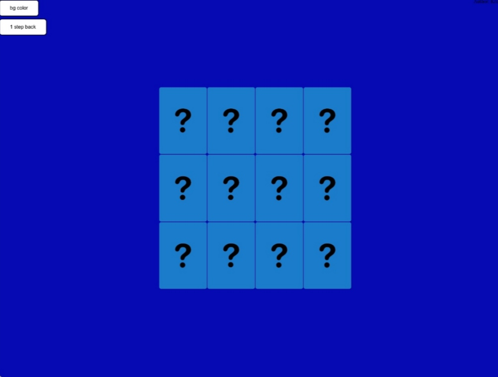

# Memory-Game
---
🎴 A simple HTML, CSS and JS web memory game

---
# Description
A simple web game of flipping and memoring the cards.
You need to find all the pairs of cards with emojis to win.
The cards are positioned randomly when the page is loaded/refreshed.

# Features
- [X]4x3 grid (12 cards)
- [X]emojies on flipped cards
- [X]Buttons:
1. Bg color: changes the background to random color
2. One step back: unflip the flipped card; revert a move

# Planning To Do
- []4x4 grid, 5x5 grid
- []change background to your chosen color or image
- []change cards color to your chosen one
- []timer
- []lives
- []count of moves
- []personal record in time and moves
- []option to choose between emojis and colors of flipped cards
- []option to design your own cards
- []winning animation

# Contribution
Any contributions are welcomed and appreciated.
Contributors will be listed under contributors section that will be added.

## Legal
This repository is meant for educational purposes.
The emoji pictures used in this repository are taken from this
[link] and are not mine.

U.S. Copyright Law also allows copyrighted materials to be used in the course of classroom presentations, assignments and learning aids.

---
Inspireed by this [video]
[link]:https://www.istockphoto.com/vector/emoticons-set-emoji-faces-emoticon-funny-smile-vector-collection-gm1133368316-300781575
[video]:https://youtu.be/ZniVgo8U7ek
